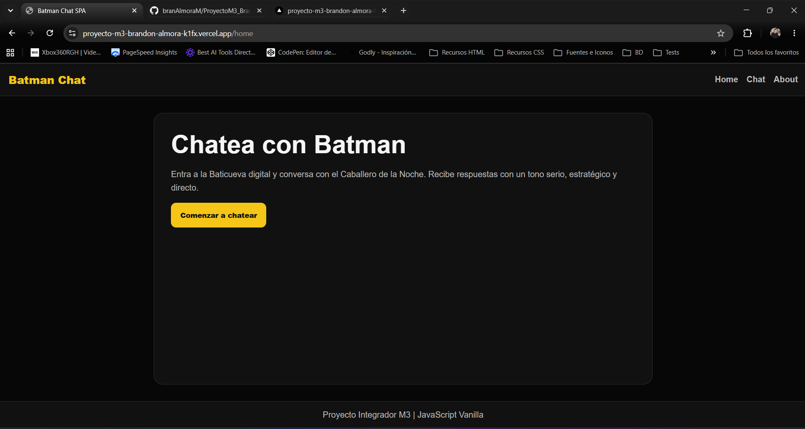
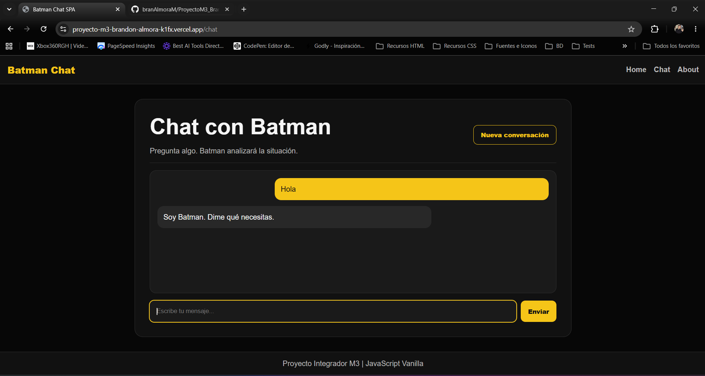
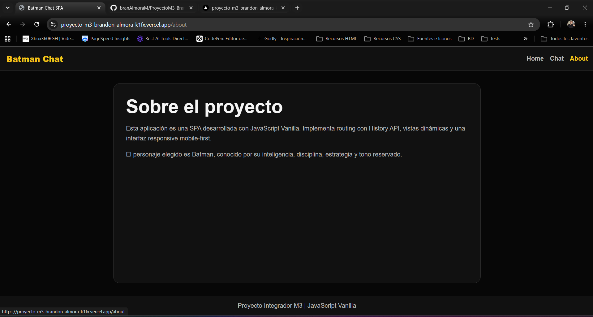

# 🦇 Batman Chat SPA

Batman Chat SPA es una aplicación web desarrollada como una **Single Page Application (SPA)** utilizando **JavaScript Vanilla**. Permite conversar con Batman mediante inteligencia artificial usando **Google Gemini**, manteniendo el contexto de la conversación durante la sesión. La aplicación implementa navegación con **History API**, una interfaz responsive y una arquitectura modular.

---

## 🌐 Demo

https://proyecto-m3-brandon-almora-k1fx.vercel.app/chat

---

## 🚀 Características

- SPA desarrollada con JavaScript Vanilla.
- Navegación entre vistas utilizando History API.
- Chat interactivo con Google Gemini.
- Personalidad personalizada de Batman mediante System Prompt.
- Historial de conversación durante la sesión.
- Indicador de "Batman está escribiendo...".
- Manejo de errores.
- Diseño responsive (Mobile First).
- Funciones Serverless mediante Vercel.
- Variables de entorno protegidas.
- Pruebas unitarias con Vitest.

---

## 📸 Capturas

### Home



### Chat



### About



---

## 🛠️ Tecnologías utilizadas

- HTML5
- CSS3
- JavaScript (ES Modules)
- Google Gemini API
- Vercel Functions
- Vitest
- Git & GitHub

---

## 📁 Estructura del proyecto

```text
ProyectoM3_BrandonAlmora
│
├── api/
│   └── chat.js
│
├── src/
│   ├── components/
│   ├── views/
│   ├── app.js
│   ├── router.js
│   ├── services/
│   ├── styles.css
│   ├── utils.js
│   └── index.html
│
├── tests/
│   └── utils.test.js
│
├── .env.example
├── .gitignore
├── package.json
└── README.md
```

---

## ⚙️ Instalación

Clona el repositorio.

```bash
git clone https://github.com/branAlmoraM/ProyectoM3_BrandonAlmora.git
```

Entra al proyecto.

```bash
cd ProyectoM3_BrandonAlmora
```

Instala las dependencias.

```bash
npm install
```

---

## 🔐 Variables de entorno

Crea un archivo `.env` en la raíz del proyecto.

```env
GEMINI_API_KEY=tu_api_key
```

También puedes utilizar el archivo `.env.example` como referencia.

---

## ▶️ Ejecutar el proyecto

Levantar el entorno de desarrollo.

```bash
npm run start
```

La aplicación estará disponible en:

```text
http://localhost:3000
```

---

## 🧪 Ejecutar las pruebas

```bash
npm run test
```

---

## ☁️ Deployment

El proyecto está preparado para desplegarse en **Vercel**.

### Pasos

1. Crear un proyecto en Vercel.
2. Conectar el repositorio de GitHub.
3. Agregar la variable de entorno:

```text
GEMINI_API_KEY
```

4. Realizar el Deploy.

---

## 🤖 Uso de Inteligencia Artificial

Durante el desarrollo del proyecto se utilizó **ChatGPT (OpenAI)** como herramienta de apoyo para:

- Planificación de la arquitectura del proyecto.
- Diseño de la estructura SPA.
- Revisión y mejora del código.
- Optimización de estilos CSS.
- Integración con Google Gemini.
- Resolución de errores.
- Elaboración de pruebas unitarias.
- Generación de documentación técnica.

Todo el código generado fue revisado, adaptado e integrado manualmente.

---

## 👨‍💻 Autor

**Brandon Almora**

GitHub:

https://github.com/branAlmoraM

---

## 📄 Licencia

Este proyecto fue desarrollado con fines educativos como parte del **Proyecto Integrador M3** del Bootcamp de Desarrollo Full Stack en SoyHenry.
